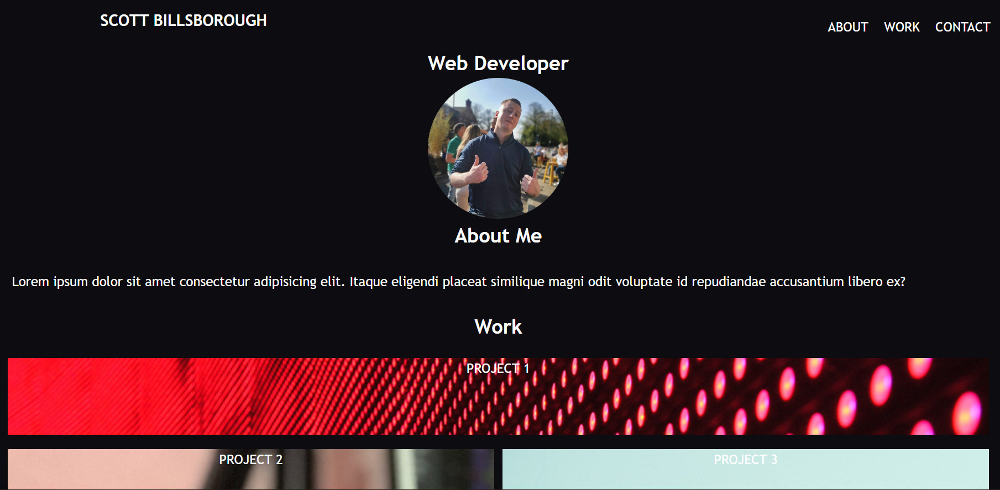

# portfolio-site

> A responsive portfolio site with a grid nav bar and layout. Working page and social media links.

## Table of contents

- [General info](#general-info)
- [Screenshots](#screenshots)
- [Technologies](#technologies)
- [Setup](#setup)
- [Live Application](#live-application)
- [Features](#features)
- [Status](#status)
- [Contact](#contact)

## General info

Portfolio site to showcase current projects that I have worked on.

## Screenshots

## Technologies

- HTML
- CSS

## Setup

Open the index.html in any modern browser.

## Live Application

https://sbillsborough.github.io/portfolio-site/

## Features

- Fully responsive
- Working navbar links
- Grid layout

## Status

_in progress_

## Contact

Created by [billsboroughscott@gmail.com] - feel free to contact me!
